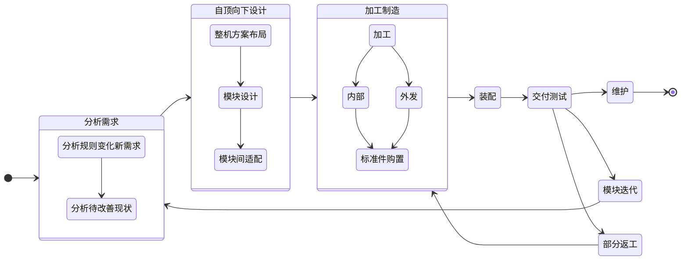

# 0.2 机械组成员的工作范围

## 工作流程
&emsp;&emsp;作为RM传统几大组机械、硬件、电控、视觉中总是工作最辛苦、{==背锅最多==}的一组，机械组身上所肩负的责任非常艰巨。可以说，一个优秀的机械组决定了队伍较高的下限。

&emsp;&emsp;机器人的结构设计决定了路过障碍路段以及飞坡过程的平稳性、发射弹道的精准性以及云台两轴的高响应速度，从而为机器人的控制提供了便捷（否则需要强大的电控去用控制弥补结构上的缺陷）。在一个高强度、长战线的竞技对抗赛事中，机器人在赛场复杂工况下的稳定性是巨大的考验，这也是对机械组工作质量的重要检验。在RM中，机器的**稳定性、一致性**是决定胜利的首要指标。

&emsp;&emsp;从工作流程上来说，机械组成员的任务就是以下几步：
>&emsp;&emsp;分析 - 设计 - 制造 - 组装 - 测试 - 迭代 - 维护

&emsp;&emsp;更详细地，可以参考下面的工作流程框架。

### 具体内容

    
    
    
     设计、制造与组装

>图片来源：Boston Dynamics视频 [Ask A Roboticist: Meet Josh](https://www.bilibili.com/video/BV1AN4y1j7yQ/)

#### 需求分析

#### 设计：建模与仿真
我们会用到CAD建模软件来具象化我们的设计思路，

#### 加工制造：自己动手与外发加工

#### 装配与电气走线

#### 交付测试与迭代

#### 后期维护

