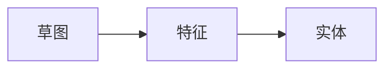
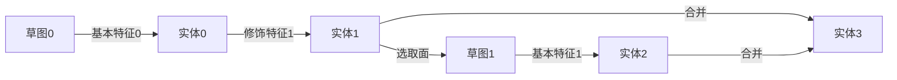

# 5.1.3 建模步骤与思路

## 最简单的建模操作
&emsp;&emsp;不管使用的工具是Fusion 360还是Solidworks，亦或是其他CAD建模软件，建模时步骤和思路都是一致的，不同的只是工具的名字、选项卡的位置、操作的键位等。这类软件在做大部分零件建模时，都有一个完整的“三步走”主线，即：

&emsp;&emsp;明白了这三个概念，你就掌握了建模的基本要领。在这里我们以SW为例，向从未接触过3D建模的同学们介绍建模的步骤和思路。

### 草图
&emsp;&emsp;想要画出一个3D的东西，就得先想想如何通过一个2D的草图生成它。打个比方，现在我们想画一个**圆锥体**。我们在义务教育阶段学过，正圆锥可以定义为一个直角**三角形**绕其中一条直角边旋转一周得到的几何体，这个直角三角形的斜边称为圆锥的母线。因此，我们需要在草图中构建这个三角形。

&emsp;&emsp;选择草图绘制，SW会自动让你选择草图平面。因为开始的时候我们什么也没有，没有一个现成的实体表面供我们选择，所以只能选择三视图的基本平面。选择前视基准面，并用直线工具绘制得到一个三角形。

    
    
    
     草图建立

&emsp;&emsp;但在这个时候，我们发现草图有的边线和端点是黑色的，另一部分是蓝色的。在SW中，默认情况下{==蓝色代表未定义==}，也就是在拖动上方和右方两个蓝色端点的时候，草图仍然会发生变化。这个时候我们就要用到**智能尺寸**，去给边线添加长度。添加完两个直角边的长度之后，三角形就被完全定义了（也叫**完全约束**）。{==草图的约束包括设置位置、添加尺寸以及设置相互之间的几何关系等。==}

    &emsp;&emsp;
    
     草图约束

???+ warning

    在建模过程中请尽量确保每一个草图都是完全定义的状态，而非欠定义或者更糟糕的过定义。开始时不确定的尺寸可以暂时保留为欠定义，但在调整完成交付时，必须保证所有草图处于完全定义状态！

### 特征

&emsp;&emsp;现在我们有了一个草图，接下来就是特征生成的环节。根据我们的思路，需要用到特征工具中的**旋转凸台/实体**。设置特征时，系统会自动捕捉草图中的闭合曲线作为被旋转的内容。设置左侧的边线为旋转轴点击确定，我们的特征操作就完成了。

    &emsp;&emsp;
    
     特征生成

### 实体

&emsp;&emsp;在特征结束后，我们在画面中获得了一个正圆锥的实体。在左侧的**特征树**中我们可以看到生成这个实体过程中用到的特征，点击下三角可以看到建立这个特征所需要的草图。草图-特征-实体，这就是建模的基本步骤。

    
     模型界面和特征树面板

&emsp;&emsp;{==特征树是一个非常重要的面板，我们不仅可以通过**上拉下方的蓝色时间轴回溯**到之前的步骤（此时时间轴后的特征被压缩），还可以方便地右击想要修改的特征或草图，重新进入参数设置界面，对模型进行些许调整。==}

## 更复杂的建模操作

&emsp;&emsp;草图中有很多工具，除了直线、圆弧、矩形等，还可以通过转换实体引用，把实体身上的线条直接投影到草图中使用；可以通过裁剪工具切除不需要的线条（生成特征需要一个完整的闭合曲面，不能多也不能少）；此外可以通过快捷键将实线转为虚线（也就是构造线/辅助线），辅助我们绘制草图（比如镜像操作时的镜像线）...

&emsp;&emsp;特征工具中，除了最常见的拉伸（拉伸切除）和旋转（旋转切除），也有更为进阶的功能。在前面没有提及的是，{==**特征未必一定要基于草图生成，也可以基于其他特征或者现有的实体生成（比如圆角操作和镜像操作等）**==}。下面的流程图是上面简单三步走流程的升级版本。

&emsp;&emsp;笔者所提及的都是将来工作时必然会用到的功能，需要同学们慢慢摸索熟悉，出现报错也无需慌张，百度或者和同学们讨论都是有效的办法。多在绘制零件的过程中多加尝试一定能够进步地更快。在下面笔者提供一张建模流程的思维导图，供初学者参考。

## 建模流程

    

